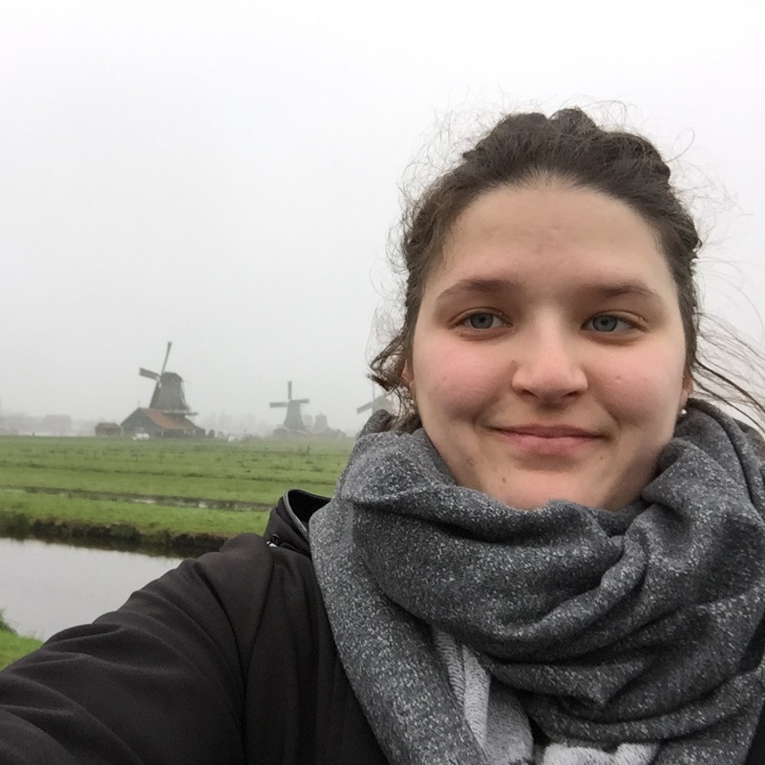

## Présentation
Je suis **doctorante** au Département des littératures de langue française à l'Université de Montréal, sous la supervision de Martine-Emmanuelle Lapointe. Je suis membre étudiante du [CRILCQ](http://www.crilcq.org/accueil/).

---

### Intérêts de recherche
Mes [travaux](cv.md) portent sur l'**enfance dans le roman québécois** contemporain, et je m'intéresse particulièrement au **rapport à la langue** et à l'**usage du langage** dans la littérature, dans une perspective d'analyse du discours dans la narration littéraire. Mes [recherches doctorales](these.md) portent sur l'énonciation à titre de moteur de l'identité *autre* de plusieurs enfants du roman québécois.

---

### Autres intérêts
J'ai également, sans avoir choisi d'en faire l'objet de mes recherches, une grande curiosité pour le numérique. J'ai, au fil du temps et des [expériences](https://github.com/emidrouin/memoire), développé des compétences et une réflexion autant techniques (quels outils choisir et comment les utiliser) que critiques (enjeux du libre accès et du logiciel libre, s[é](https://ctf.ageei.uqam.ca/team/38)curité et meilleures pratiques) par rapport au numérique et à son utilisation, notamment en milieu académique.

---

### Communication à venir
`21 avr.`
**Le vrai du faux: le mensonge comme une figure de style dans la trilogie de La Bête (David Goudreault)**  
*Journée d'étude "De Cassandre aux faits alternatifs: Les voix du mensonge et de la vérité en littérature"* organisée par l'AECSEL, 21 avril 2020, UQÀM.
