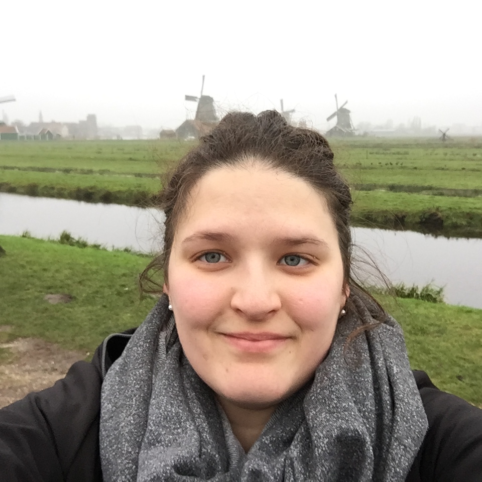

## Présentation
Je suis [**doctorante** au Département des littératures de langue française à l'Université de Montréal](https://littfra.umontreal.ca/repertoire-departement/corps-professoral/professeur/in/in37063/sg/Emilie%20Drouin/), sous la supervision de Martine-Emmanuelle Lapointe. Je suis membre étudiante du [CRILCQ](http://www.crilcq.org/accueil/).

---

### Intérêts de recherche
Mes [travaux](publi-comm.md) portent sur l'**enfance dans le roman québécois** contemporain, et je m'intéresse particulièrement au **rapport à la langue** et à l'**usage du langage** dans la littérature, dans une perspective d'analyse du discours dans la narration littéraire. Mes [recherches doctorales](these.md) portent sur l'énonciation à titre de moteur de l'identité *autre* de plusieurs enfants du roman québécois.

J'ai également, sans avoir choisi d'en faire l'objet de mes recherches, une grande curiosité pour le numérique et les enjeux qu'il convoque en milieu académique: choix et utilisation des outils et des formats, notamment pour la [rédaction académique](https://github.com/emidrouin/memoire), libre accès et logiciel libre.

---
### Publications récentes

`2023`
**Récit d’héritage, de transmission et de passation: l’expérience corporelle et la construction identitaire dans *Le corps des bêtes***  
*@nalyses*, vol. 17, n° 1, hiver 2023.
- Résumé et article disponibles sur [Érudit](https://www.erudit.org/fr/revues/analyses/2023-v17-n1-analyses07763/1097234ar/)  
